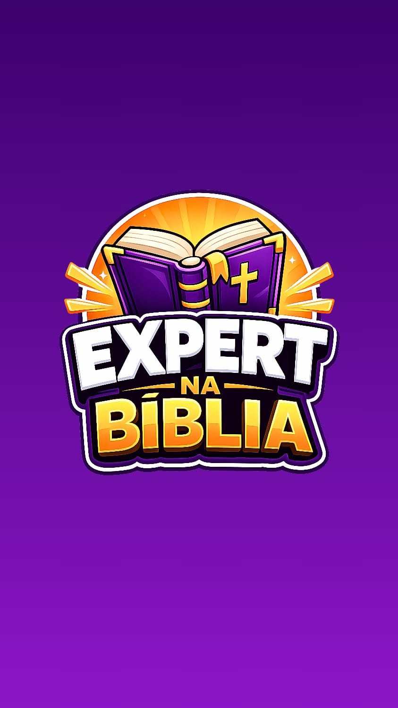

# 03 — Identidade Visual

> Logo, paleta de cores, personagem e elementos visuais fornecidos pelo usuario no grupo de
> WhatsApp em 2026-06-22.

## Logo

O logo e o elemento central da identidade visual. E um **livro aberto roxo com uma cruz dourada**
no centro, **raios dourados** ao fundo (formato de auréola/sol nascente), e o nome **"EXPERT NA
BÍBLIA"** em destaque. O nome usa fontes diferentes em cada parte:

- **"EXPERT"**: fonte bold branca com borda preta (estilo comic book / sticker)
- **"NA"**: fonte menor preta (conector)
- **"BÍBLIA"**: fonte bold com degradê laranja/dourado (de #fded48 a #fd8414), com borda preta
  e brilho

### Variantes disponiveis

| Arquivo no Drive | Descricao |
|---|---|
| https://drive.google.com/file/d/12FS7Tac60Wqq723k4HpxUeq3IYkgBahj | Variante 1 do logo |
| https://drive.google.com/file/d/1HKhPM1L4fuckjf49uQ6gml1_1QSQcUhY | Variante 2 do logo |
| https://drive.google.com/drive/folders/1wpzcW9gs8T8BWZjlTIP07VlVmsyN919f | Pasta completa de logos |

### Referencia local

Screenshot do logo principal (carregado do grupo):

## Paleta de Cores Oficial

Definida em 2026-06-22 17:49 (versao final, com adicao do preto):

| Nome | Cor 1 | Cor 2 | Uso principal |
|---|---|---|---|
| **Degradê Roxo** | `#8b16c7` | `#3c026d` | Fundos de cards, botoes, campo de resposta |
| **Degradê Laranja** | `#fded48` | `#fd8414` | Bordas de destaque, texto de palavras-chave, trofeu |
| **Branco** | `#ffffff` | — | Fundo geral, quadros de texto, perguntas |
| **Preto** | `#0b0012` | — | Bordas, sombras, texto secundario, detalhes |

### Referencia local da paleta

| Imagem | Descricao |
|---|---|
| `../../whatsapp_media/images/image_20260622_162013.jpg` | Paleta 1 |
| `../../whatsapp_media/images/image_20260622_162013-1.jpg` | Paleta 2 |
| `../../whatsapp_media/images/image_20260622_162014.jpg` | Paleta 3 |

Pasta completa: https://drive.google.com/drive/folders/1i6Ahy5A1bQ1Ra4SpGVoobve4_3R8npgv

## Tom Visual

- **Estilo**: cartoon/playful, comic book com sombras e bordas pretas grossas em stickers
- **Genero**: infantil-juvenil, mas com conteudo adulto (teologia)
- **Acabamento**: gloss/shine nos elementos (livros, trofeu), confetes e faiscas em momentos de
  vitoria, brilhos dourados em destaque

## Personagens (mascotes)

Dois personagens principais do tipo **livro antropomorfico**:

### Personagem 1 — Livro Dourado/Laranja (modo Licoes)

- **Corpo**: livro amarelo/dourado com capa dura, cantos arredondados
- **Cruz**: dourada pequena no centro da capa
- **Detalhes**: olhos grandes, bracos com luvas brancas, pes com sapatos amarelo-roxos
- **Variacao de expressoes**: pensativo (tela de pergunta), assustado (erro), feliz (acerto),
  neutro
- **Direcao**: `../../whatsapp_media/images/image_20260622_211747.jpg` (personagem pensativo na tela
  de pergunta do quiz)
- **Pasta**: https://drive.google.com/drive/folders/1rGy3F3q45aJCY6ipDTYyf3Ir88ykjzDm

### Personagem 2 — Livro Roxo (modo Quiz)

- **Corpo**: livro roxo escuro com a cruz dourada grande no centro da capa, fita dourada de
  marcador
- **Detalhes**: olhos grandes expressivos, bracos com luvas brancas, pes com sapatos roxos com
  detalhes dourados
- **Variacao de expressoes**: assustado (erro), feliz (acerto), exclamando "Uau!" (100%),
  triste (< 50%)
- **Direcao**: `../../whatsapp_media/images/image_20260622_212830.jpg` (modo erro)
- **Direcao**: `../../whatsapp_media/images/image_20260622_213156.jpg` (modo triste)
- **Direcao**: `../../whatsapp_media/images/image_20260622_213535.jpg` (modo Uau!)

## Trofeu (Tela Final de Conquista)

Tela exibida quando o usuario conclui todos os modulos OU acerta 100% do quiz.

- Trofeu dourado com bracos, punhos erguidos, sorriso largo
- Olhos expressivos com brilho
- Sapatos roxos com detalhes dourados
- **Confetes roxos e dourados** ao redor, faiscas/diamantes brilhantes
- Texto "Parabens, voce e um Expert!" — "Parabens," em branco com borda preta, "voce e um" em
  branco com borda preta, "Expert!" em degradê roxo grande com borda preta
- **Direcao**: `../../whatsapp_media/images/image_20260622_215940.jpg`

## Elementos de UI

Pasta: https://drive.google.com/drive/folders/14JIk5aj_8C5UyLlSfXAaBlrUbPD0J6Hd

Padroes observados nas imagens:

| Elemento | Especificacao inferida |
|---|---|
| Cards de modulos | Fundo degradê roxo, borda grossa degradê laranja/dourado (~3-4px), cantos arredondados |
| Botoes primarios | Mesma estilizacao dos cards (fundo roxo + borda laranja) |
| Campo de resposta | Fundo degradê roxo, borda laranja, texto branco |
| Quadro branco | Fundo branco puro, borda preta, cantos arredondados — usado para perguntas |
| Icone de som | Icone de speaker branco, canto inferior direito da maioria das telas |
| Icone de home | Icone de casa, canto inferior direito da tela de pergunta |
| Botao de configuracao | 3 linhas horizontais (≡), canto superior direito, cor laranja |
| Botao "RECOMECAR" / "PROSSEGUIR" / "PROCEGUIR" | Fundo roxo, texto branco, cantos arredondados |
| Botao de navegacao (seta) | Setas roxas em circulo, usadas na tela de erro para voltar/prosseguir |

## Tipografia (inferida das imagens)

- **Display / Titulos** (tipo "EXPERT NA BÍBLIA", "Estrutura da Biblia", "Uau!", "VOCE PASSOU!"):
  fonte bold sans-serif estilo comic book / sticker, com bordas pretas grossas; pode ser uma
  variante de **Bangers**, **Luckiest Guy**, **Lilita One** ou similar do Google Fonts
- **Corpo / Perguntas** (texto das perguntas no quadro branco): fonte sans-serif limpa e legivel,
  parece **Nunito** ou **Quicksand** (arredondadas, face amigavel)
- **Numeros / Contadores** ("1-30", "10 de 30"): mesmo estilo display, em destaque

> **Acao**: confirmar fontes exatas com o usuario antes de implementar; pedir referencia de
> Google Fonts mais proxima do estilo desejado.
